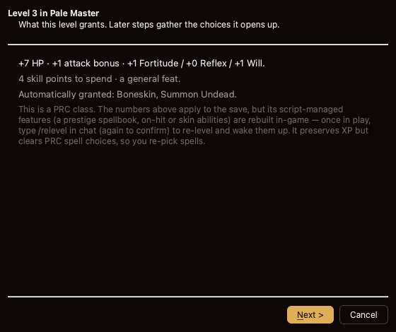

# NWN Save Editor

Read and edit **Neverwinter Nights** save games — and the file formats behind them.

[](https://github.com/yabisiktir/nwn-save-editor/actions/workflows/build.yml)
[](LICENSE)
[](pyproject.toml)
[](#building-a-standalone-app)


Every change is staged first — nothing touches the save until you **Save as New**
(a new folder; the original is never modified) or **Overwrite** (written and
verified to the side, the old save archived first) — and anything staged can be
undone, redone or discarded. **Strict** mode holds you to the game's rules; **Free**
lets you break them.

The full walkthrough is in [docs/save_game_editor.md](docs/save_game_editor.md).

## Contents

- [What it can edit](#what-it-can-edit)
- [A look at it](#a-look-at-it)
- [Installing & running](#installing--running)
- [Where it looks for the game](#where-it-looks-for-the-game)
- [Building a standalone app](#building-a-standalone-app)
- [Development](#development)
- [Architecture](#architecture)
- [Embedding it](#embedding-it)
- [Your saves are safe](#your-saves-are-safe)
- [Used by](#used-by)
- [Thanks](#thanks)
- [Licence](#licence)

## What it can edit

| Section | What you can do |
|---|---|
| **Character** | Ability scores, AC, HP, saving throws (with the gear/ability portions broken out), alignment, age, gold, XP, name, race, appearance, and a portrait picker that shows the actual pictures, not resref filenames. |
| **Skills** | Ranks, capped correctly by whether it's a class or cross-class skill. |
| **Feats** | Add and remove, filterable to the ones you actually qualify for. PRC feats are badged, and the picker tells you *in advance* whether a save-edit can actually grant that one. |
| **Spellbook** | Known / memorized spells, per caster class and level; Strict mode only offers spells that class actually casts at that level. |
| **Class levels** *(opt-in)* | A step-by-step wizard levels the character up from the game's own class tables (base and PRC): hit points, attack, saves, the skill-point budget, a feat/ability point when due, and spells for a spontaneous caster — prerequisites checked, per-level history written. |
| **Items** | Every magical property, edited straight from the game's `iprp_*` tables so only values the engine accepts are offered. Add a copy of your own item, or clone one out of a store, creature or container. |
| **Inventory & Equipment** | Paperdoll of worn slots, the carried bag (including nested containers), and — for PRC characters — the natural-weapon set and the PRC skin. |
| **Area contents** | Store pricing and stock, creature gear, container loot, and the module's factions. |
| **Quests & World State / Party & Campaign** | The module's persistent script variables (searchable, editable) and party-wide settings. |
| **Raw GFF** *(advanced)* | The save's whole decoded tree, any field editable. Id fields (a feat, a class, an item property) read out in plain language and edit **by name**; a struct or list can be exported to its own GFF file or imported back in. |
| **Backups & diff** *(advanced)* | What an overwrite archived, and a field-by-field diff between two saves. |

See [docs/save_game_editor.md](docs/save_game_editor.md) for the full guide, section by section, including what changes when a save uses **PRC**.

## A look at it

Adding a class level is a real level-up, worked out from the game's own class
tables and gathered by a wizard — here the first step, with the hit points,
attack, saves and feats the level grants, and the PRC re-level caveat:



Inventory and equipment, with each item's real in-game icon — worked out from the
game's own files, including the ones custom content adds:


The module's persistent script variables — the flags and counters a campaign uses
to remember what you did — searchable and editable:


Portraits are chosen by looking at them. Only 275 of the game's 1,594 are of
people at all, so it opens on the ones that fit this character:


## Installing & running

```bash
pip install -e ".[dev]"
nwn-save-editor
```

`python -m nwnsaveeditor.ui.editor` works the same from a checkout.

```bash
nwn-save-editor [--game-root PATH] [--user-dir PATH] [SAVE_FOLDER ...]
```

Naming save folders opens exactly those; with none it lists everything under the
user directory's `saves`.

## Where it looks for the game

Two folders matter, and they are not the same thing:

- **The user directory** — your `saves`, `hak`, `portraits` and `override`.
- **The game root** — the installation. Only needed for *names*: items, feats,
  spells and item properties are stored as numbers, and the names come from the
  game's 2DAs and `dialog.tlk`. Without it the editor still opens and still edits,
  but shows raw ids — and says so on startup rather than leaving you to wonder.

Each is settled once, in this order: **1)** what you passed on the command line,
**2)** what was saved last time, **3)** detection. Whatever it lands on is written
back, so `--game-root` is a one-time flag rather than one you retype every launch.

**Detection** checks Steam's library folders (not only the default one), GOG and
Beamdog installs, and Wine/CrossOver prefixes. The user directory differs by
platform:

| Platform | NWN user directory |
|---|---|
| macOS | `~/Documents/Neverwinter Nights` |
| Windows | `%USERPROFILE%\Documents\Neverwinter Nights` |
| Linux | `~/.local/share/Neverwinter Nights` — **not** `Documents` |

**Item icons** are worked out from the game's own files, including custom content's
haks (on by default — CEP's Robes of Sesustris, for example, has an icon that
exists nowhere else). Both this and "work each item's own icon out" can be turned
off under **Settings…**.

### Settings file

| Platform | Path |
|---|---|
| macOS | `~/Library/Application Support/nwn-save-editor/save_editor.json` |
| Windows | `%APPDATA%\nwn-save-editor\save_editor.json` |
| Linux | `~/.config/nwn-save-editor/save_editor.json` |

```json
{
  "save_editor_theme": "dark",
  "hak_item_icons": true,
  "exact_item_icons": true,
  "enable_class_level_editing": false,
  "extra_save_dirs": ["/Volumes/backup/nwn-saves"],
  "game_root": "/path/to/Neverwinter Nights",
  "game_user_dir": "/path/to/Documents/Neverwinter Nights"
}
```

`extra_save_dirs` are folders scanned for saves *besides* `<user_dir>/saves` — each
one holds NWN save sub-folders (a second saves directory, a backup drive). Manage
them in **Settings… → Additional save folders**; the sidebar updates as you add or
remove one.

`enable_class_level_editing` is **off by default**: adding a class level is a real
level-up, not a field edit, so the wizard stays behind a switch you turn on
deliberately. Edit the file by hand or delete it to start over — a missing or
malformed file falls back to detection rather than failing.

## Building a standalone app

```bash
pip install pyinstaller
python scripts/build_app.py
```

Produces a self-contained app with Python, Qt and the game tables inside it —
about 45 MB packaged, 100 MB installed.

| Platform | Artifact |
|---|---|
| macOS | `dist/nwn-save-editor-<ver>-macos-<arch>.dmg` |
| Windows | `dist/nwn-save-editor-<ver>-windows-x64.zip` |
| Linux | `dist/nwn-save-editor-<ver>-linux-<arch>.tar.gz` |

**Each artifact must be built on the OS it targets** — no cross-building, and no
cross-architecture either (PySide6 ships per-arch wheels). Nothing is signed:
macOS Gatekeeper will ask for right-click → Open the first time, and Windows
SmartScreen will warn.

## Development

```bash
scripts/check.sh                # everything CI checks: ruff, then pytest
ruff check src tests scripts    # just the lint
pytest                          # ~1000 headless tests; no display needed
```

```bash
git config core.hooksPath .githooks   # once, per clone — fast lint on every commit
```

Tests run offscreen (`QT_QPA_PLATFORM=offscreen`) and need neither a display nor a
real game install; a few that want real game files skip themselves unless you point
`NWN_TEST_NIT_STORE` at some. CI runs the suite on Linux, Windows and macOS and
builds each platform's artifact on every push.

**Checking Windows behaviour from a Mac:** if CrossOver is installed,
`scripts/win_test.sh` runs the tests against a real Windows Python inside a
bottle — genuine `os.name == "nt"`, cp1252 locale encoding, `ntpath`:

```bash
scripts/win_test.sh --setup   # once: create the bottle, install Python and Qt
scripts/win_test.sh           # run the tests as Windows sees them
scripts/win_test.sh --shot    # render the main window as Windows draws it
```

Wine is not Windows — file locking, ACLs and Win32 edge cases differ — so this is
a third cheap signal, not a replacement for the Windows CI job.

## Architecture

Two packages, one direction of dependency:

- **`nwnfile`** — the formats (GFF, ERF, 2DA, TLK, KEY/BIF, TGA, PLT) and the game
  data that gives them meaning: which feat id is Whirlwind Attack, what item
  property 12 does, what a race id is called. No Qt, no application — it reads
  files.
- **`nwnsaveeditor`** — decoding a `.sav`, staging edits against it, writing a
  verified new save, and the editor window over all of it.

`nwnfile` never imports `nwnsaveeditor`, and never imports Qt — tests hold the
boundary in place.

## Embedding it

Everything the editor asks of a host is one small protocol —
`nwnsaveeditor.ui.editor.host.EditorHost`: where the game is, and how to remember
the light/dark choice. `StandaloneHost` is the whole of what a bare launcher
provides; an application supplies its own and opens `SaveEditorWindow`.

The extras are opt-in: a host that offers `set_game_paths` makes the game folders
editable, `portrait_path` lends its portrait cache, and `set_class_level_editing`
surfaces the class-level toggle. Absent any of them, the editor hides the feature
rather than writing somewhere it never reads.

## Your saves are safe

**Save as New Save…** never touches the original. **Overwrite This Save…** writes
and verifies to a staging folder first, then archives the old save to a timestamped
folder before swapping. After writing, the new save is re-read and byte-verified;
a failed write cleans up rather than leaving a corrupt save.

> Always test an edited save in-game before relying on it, especially anything
> PRC-related — the editor cannot load a save in NWN to confirm it.

See [docs/save_game_editor.md](docs/save_game_editor.md) for the full safety model
and what PRC changes about all this.

## Used by

[Vaultkeeper](https://github.com/yabisiktir/vaultkeeper), an NWN mod installer and
manager, embeds this editor and ships it inside its own application.

## Thanks

To **Surazal**, author of the *NWN Installer Tool*. Its file-format code,
converted to Python, is part of what this is built on — NWN's formats are not
documented by BioWare, and having a known-correct implementation to work from is
why this reads real saves rather than an approximation of them.

## Licence

GPL-3.0-or-later. See [LICENSE](LICENSE).
