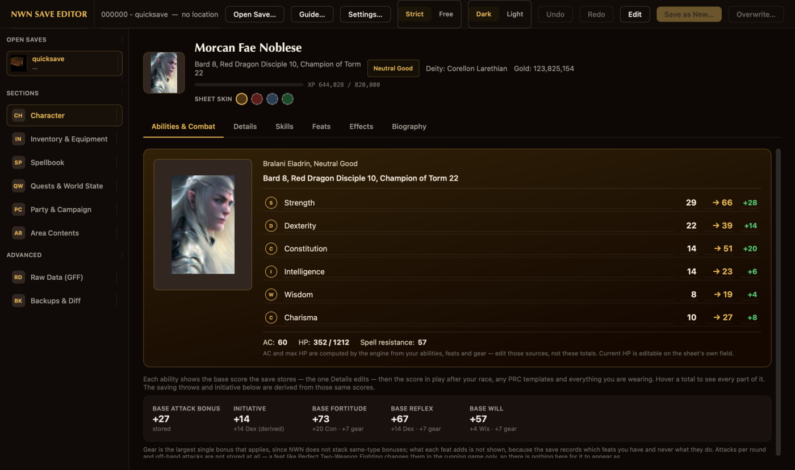
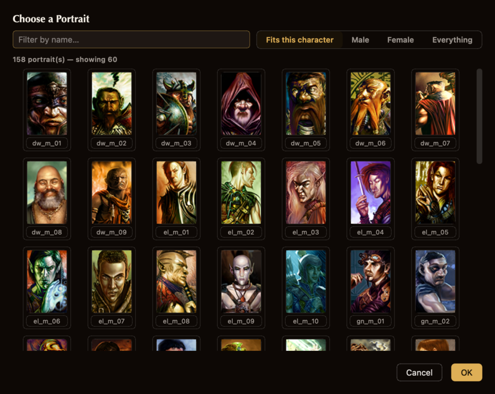
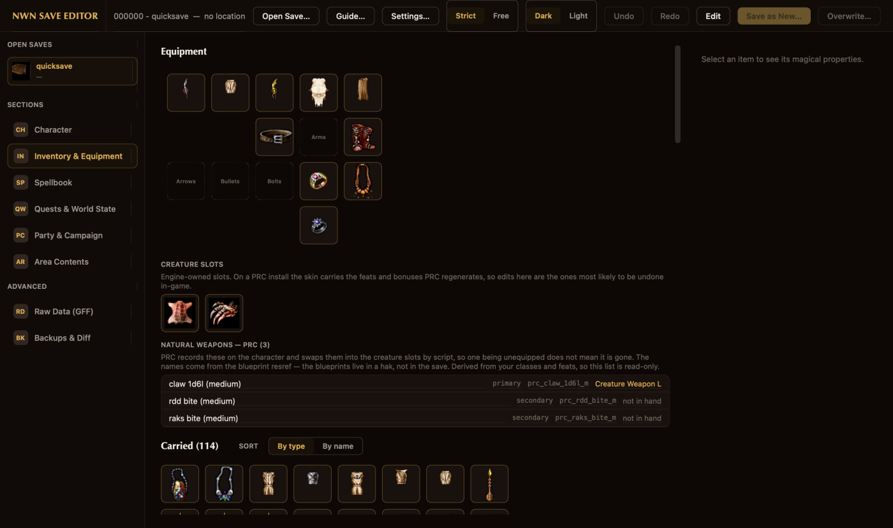
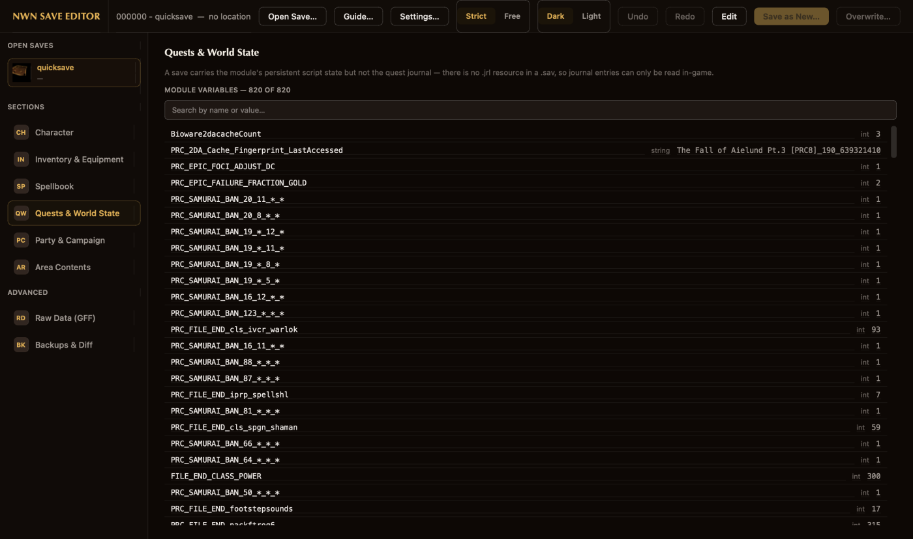

# Save Game Editor — Guide

The editor opens as a full window: a sidebar of sections on the left, the section
you picked in the middle, and a detail panel on the right where the section has
one. Run it on its own with `nwn-save-editor`, or from inside Vaultkeeper with
**Tools → Save Game Editor**.

Your original save is never modified in place unless you explicitly ask for it, and
even then it is archived first. Editing is safe to experiment with.

## Running it on its own

The editor does not need Vaultkeeper. It runs as its own application:

```bash
nwn-save-editor
```

or, from a checkout, `python -m nwnsaveeditor.ui.editor`. With no arguments it
finds the game and your saves in the usual places; `--game-root` and `--user-dir`
override that, and save folders can be named directly.

Everything it asks of whatever is hosting it is one small protocol —
`nwnsaveeditor.ui.editor.host.EditorHost`: where the game is, and how to
remember the light/dark choice. Vaultkeeper's own controller satisfies it, and so
does the standalone launcher, which keeps its own settings file rather than writing
to the app's.

## Quick start

1. **Tools → Save Game Editor**, and pick a save.
2. Turn on **Edit** in the toolbar. Read-only is the default, so a stray click cannot
   change anything.
3. Make changes. Each one is *staged* — nothing is written yet — and appears in the
   **change ledger** with a gold ● on the thing you changed. **Undo**, **Redo** and
   per-change **Discard** all work.
4. Commit one of two ways:
   - **Save as New Save…** — writes a new save folder beside the original, which is
     left untouched. Safest, and the default.
   - **Overwrite This Save…** — replaces the selected save. The edited save is fully
     written *and verified* to a staging folder before the old one is touched, and
     the replaced version is moved to a timestamped folder under
     `…/Neverwinter Nights/vaultkeeper_backups/`, so it stays recoverable.

**Discard All** drops every staged change.

## Strict and Free

The toolbar's rule mode decides how far a value may go.

- **Strict** — the game's own limits. A spell can only be added to a level its class
  actually casts; a skill cannot exceed its rank cap.
- **Free** — only the field's *storable* range applies. That range is a property of
  the file format and binds in both modes; Free says so wherever it widens something.

## Sections

### Character



Six tabs.

- **Abilities & Combat** — the character sheet: ability scores with their modifiers,
  AC and HP, and the stored combat numbers. Those are labelled **base** deliberately:
  they are the values the save holds, and the same ones Details edits. The engine
  recomputes what it shows in-game from these plus your ability modifiers, gear and
  feats. The ability modifier and the largest applicable gear bonus are shown as
  separate parts beside each saving throw rather than folded into a total.
  Attacks per round and off-hand attacks are **not stored at all** — the engine
  computes them, so a feat like Perfect Two-Weapon Fighting has nothing here to
  appear as.
- **Details** — every editable field on the record: gold, experience, alignment, age,
  current HP, the three base saves, first and last name, **race**, appearance and
  portrait. Race, appearance and portrait are pickers. A PRC race is badged and warns
  before staging, because PRC builds its races from scripts and the creature skin,
  not from the stored byte alone.

  

  **Portrait is a grid of the actual pictures**, because `dw_f_07_` tells you nothing
  and there are 1,594 of them. It opens on the ones that fit this character — only 275
  of the base game's portraits are of people at all, the rest being creatures and
  scenery — with **Male**, **Female** and **Everything** a click away and a name filter
  beside them. Whatever the character already wears stays on screen even when the
  filter excludes it, so OK never confirms something you cannot see.

  **Show all** puts every match on screen at once — sixty at a time through 1,594 is
  twenty-six clicks. The cells appear immediately and the pictures fill in behind,
  a few per turn of the event loop, so the window stays usable while it catches up;
  scroll anywhere and the portraits you are looking at are read first.
- **Skills** — rank and the computed total (rank + key ability + equipped-item
  bonuses), sortable and filterable.
- **Feats** — add and remove. PRC feats are badged: PRC regenerates them onto the
  creature skin, so an edit to one may not stick in-game. Base-game feats do.
- **Effects** — what the save's `EffectList` holds, or a switch to **active bonuses**:
  where each number comes from, attributed to the item, class or spell that supplies
  it. What a *feat* contributes is not shown, because the save records which feats
  you have and never what any of them does.
- **Biography** — the written biography, with the name shown read-only. Details is
  the one place it is edited.

### Inventory & Equipment



A paperdoll of the worn slots, the carried bag grouped by container, and a detail
panel for the selected item.

**Bags carry a count in the corner** — that gold number is how many things are
inside, and it is what tells a bag apart from anything else in a grid of icons.
**Double-click one** to jump to its contents, which sit further down the same page
under an "Inside …" heading; **Show the bag** on that heading scrolls back to the
bag itself. Nothing is hidden or collapsed, so a search of the page still finds
everything — the jump only saves the scrolling.

**"Unique Power"** (and Sequencer, and the other Activate Item rows) is the one
property that describes no effect. The item does nothing by itself: using it fires
the *module's* `OnActivateItem` event, and a script there decides what happens,
recognising the item by its **tag**. That is why two items with this same property
do completely unrelated things, and why nothing in the save can tell you what
either of them does. The panel says so, and names the tag — which is the only part
of the answer the save actually holds.

Item properties are edited from the game's own `iprp_*` tables, so every value you
can pick is one the engine recognises. **Add a property…** offers every property type
the game defines — around 200 on a full install — with a searchable picker when the
subtype list is long, so a Bonus Feat reaches the whole feat list. To change a
property's *type*, remove it and add the one you want.

The creature slots are shown apart, including the **PRC skin**, which is where PRC
puts the feats and bonuses it regenerates.

Below them, **Natural weapons — PRC**. A claw or a bite is an ordinary item in a
creature weapon slot, so only the one currently in hand shows as equipment — but PRC
keeps the whole set on the character and swaps them in by script. This lists what it
has recorded and whether each is in hand, so an unequipped bite does not look lost.
Read-only: PRC derives the set from your classes and feats and rewrites it.

### Spellbook

Caster class along the top, spell level below it, and the list for that level.
**All** shows the whole book at once with each row tagged by level.

Adding is done from a level tab, because an add needs a level to write into. In
Strict the picker offers only what that class casts at that level — the save stores
a bare spell id in a level-numbered list, so an unfiltered picker would happily put
a level-6 wizard spell in a bard's cantrips. A PRC prestige spellbook is badged and
warns first.

### Quests & World State



The module's persistent script variables. Object and location variables are shown but
not editable — they are runtime handles, and setting one by hand points a script at
something that is not there.

There is no journal: a `.sav` does not bundle a `.jrl`.

### Party & Campaign

Party-wide settings. The campaign database is reported rather than opened.

### Area Contents

Browse an area's stores, creatures and containers.

- **Store pricing** — buy markup, sell-back markdown, store gold, identify price,
  max buy price, black market.
- **Item properties** — a chest's loot and a creature's gear use the same property
  editor your own items do.
- **Whole items** — **Duplicate here** and **Remove from the world…** on a selected
  item, and **Place an item here…** on a selected store, creature or container, which
  puts a *copy* of one of yours into it.
- **Add a copy to my inventory** takes a copy the other way and leaves the world
  alone.
- **Variables** — the area's own script state, the same kind Quests & World State
  shows for the module and edited the same way (**Edit Variable…**). Object and
  location variables are read-only here for the same reason they are there.

The **factions** listed under an area are the *module's*, not that area's, so they
read the same whichever area you are looking at — and saves of the same module share
them. A reputation marked *(default)* is one the module never customised: `RepList`
stores only the pairs that were changed, and an unlisted pair is neutral.

Editing any of these changes the *area*. Removing an item renumbers everything after
it in the same list, and anything already staged against one of those follows the
item it belongs to.

### Raw Data (GFF) — advanced

Every resource in the save, as its decoded struct/field tree. It is deliberately
unhelpful: it bypasses the friendly editors, so its changes are marked **raw** in the
ledger.

- Scalars are editable, and a field's type is always preserved — a raw edit can break
  the game's *rules*, not the *file*. **Double-click** a row to edit it.
- A list of structs can gain and lose entries. **Duplicate entry** copies a sibling,
  which is the reliable route: the copy already carries the fields, types and struct
  type the game expects there. **Add blank entry** can only *seed* one — it takes the
  first sibling's field set and zeroes the values, so you get the right shape and have
  to fill it in. The line under the buttons says which you got.
- Removing an entry renumbers every entry after it, and staged changes follow.
- The tree keeps its open nodes, selection and scroll position across an edit.
- **Property reference ›** folds out beside the tree: what every item property means,
  the values it accepts, and which of your items carry it — so a raw `CostValue` can
  be read without leaving the tree. A stored `CostValue` is a *row* in a cost table,
  not the number itself.

Raw edits touch **one resource only**: editing `module.ifo` does not mirror into
`player.bic` the way the friendly editors do.

### Backups & Diff — advanced

What an overwrite archived, and a field-by-field diff between two saves.

## What PRC changes about all this

If your game uses the **PRC** (Player Resource Consortium), a great deal of the
character is script-managed, through PRC's own scripts and the character's hidden
*skin* item. The editor detects this and warns rather than pretending otherwise:

- **Feats** live on the creature skin and are regenerated from PRC's own data.
- **Races** are built from scripts and the skin, not from the stored byte alone.
- **Prestige spellbooks** are rebuilt by PRC.
- **Natural weapons** are recorded on the character and equipped by script.

Base-game edits stick. PRC ones may revert at the next rest, level-up or area load —
which is why each is flagged before it stages, not after it fails.

## Safety model

- **Save as New Save…** never touches the original. **Overwrite This Save…** writes
  and verifies to a staging folder first, then archives the old save to a timestamped
  `vaultkeeper_backups/` folder before swapping.
- The character lives inside the save's `module.ifo`, under `Mod_PlayerList[0]`. That
  is authoritative; the folder's `player.bic` is a mirror, and every character edit is
  written to both.
- After writing, the new save is re-read and byte-verified; a failed write cleans up
  rather than leaving a corrupt save.

> **Always test an edited save in-game before relying on it**, especially anything
> PRC-related. The editor cannot load a save in NWN to confirm it.
